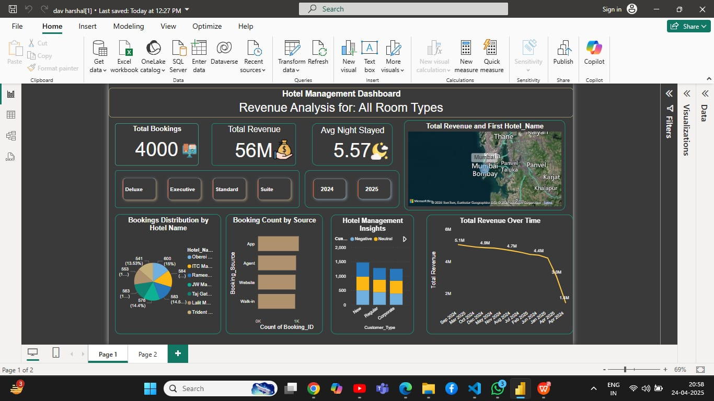

📊 Hotel Management Dashboard
This interactive Power BI dashboard provides comprehensive insights into hotel performance across multiple room types and booking sources. 
The goal is to help hotel managers and stakeholders make data-driven decisions.

 Key Features:
✅ Total Bookings: Displays total number of bookings across all hotels.
💰 Revenue Analysis: Tracks total revenue (₹56M+) and revenue trends over time.
🌙 Avg. Nights Stayed: Shows the average duration of customer stays.
📍 Geo-Insights: Map visual highlighting top-performing hotels by location.
🏨 Room Type Analysis: Filter data by Deluxe, Executive, Standard, or Suite rooms.
📅 Year-wise Comparison: Switch between 2024 and 2025 data.
📈 Booking Source Breakdown: Visualizes bookings by app, website, agents, and walk-ins.
📊 Hotel-wise Distribution: Pie chart showing hotel-wise bookings share.

🛠 Tools Used:
Power BI – for dashboard development and data visualization
Excel / CSV – for structured data input

📁 Dataset Info:
The dataset used contains hotel bookings, customer types, revenue data, and hotel locations. (Dummy data for academic/demo purposes)

🎯 Use Case:
Ideal for hotel managers, operations teams, and marketing professionals looking to:
Identify high-performing hotels
Analyze booking behavior by source
Optimize room pricing and availability

